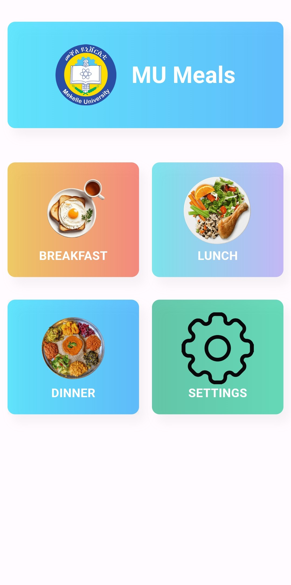
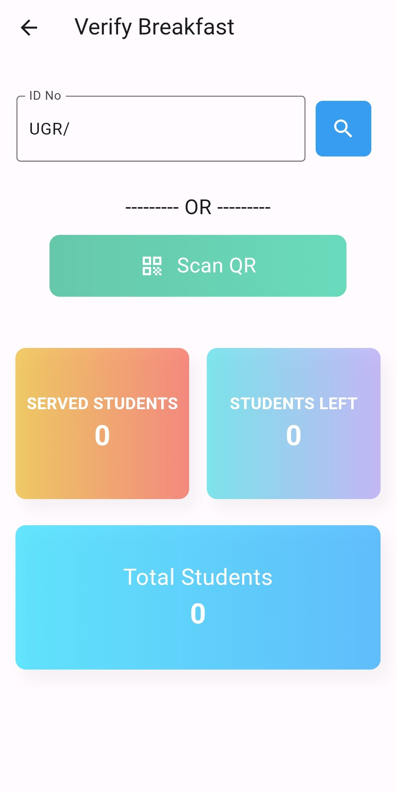
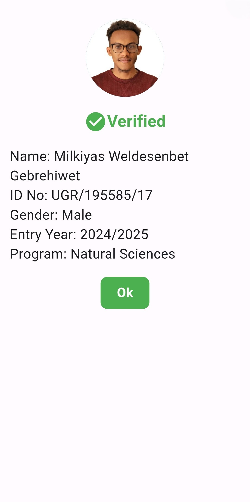
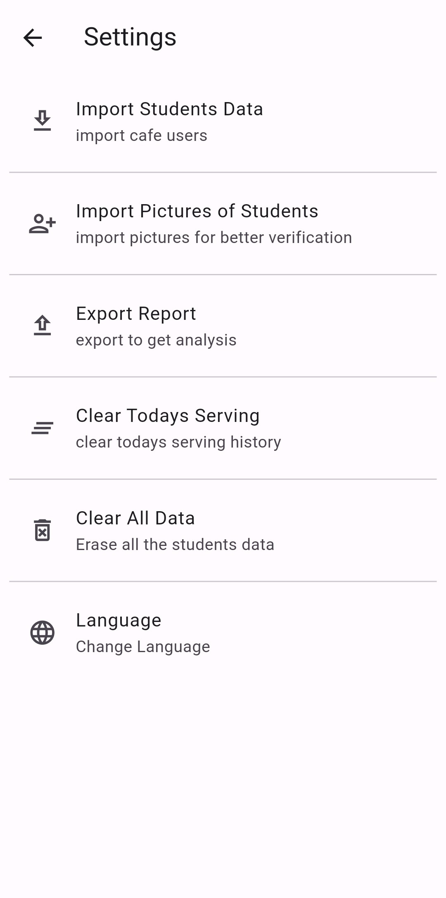

# MU Digital Meal Management System 🍽️

A **fully offline, mobile-based meal verification and reporting system** developed to modernize and secure campus cafeteria operations at **Mekelle University**.

---

## 🖼️ App Screenshots

  
  
  
  

---

## 📌 Overview

Managing student meal distribution manually is error-prone, slow, and vulnerable to misuse.  
This project replaces traditional tick-marking and physical meal cards with a **digital, automated verification system** that ensures **accuracy, efficiency, and accountability**.

The system is designed for **low-resource environments**, operating **entirely offline** while still providing reliable verification, reporting, and fraud prevention.

---

## 🎯 Problem Statement

Traditional meal management systems face several challenges:

- Manual tick-marking leads to **human error**
- Students can **enter multiple times** for the same meal
- No reliable way to **generate reports**
- Difficult to verify **identity authenticity**
- Inefficient for large student populations

---

## ✅ Solution

The **MU Digital Meal Management System** is a **Flutter-based mobile application** that:

- Verifies students using **QR code scanning or ID input**
- Prevents **duplicate meal entries** per time slot
- Displays **student photo** for identity confirmation
- Generates **automated, categorized reports**
- Works **100% offline** using a local SQL database
- Supports **multiple languages** for accessibility

---

## 🛠️ Key Features

### 🔐 Meal Verification

- QR code scanning and manual ID input
- Real-time eligibility checks
- Automatic duplicate prevention (Breakfast / Lunch / Dinner)

### 🧑‍🎓 Identity Confirmation

- Displays student profile photo after scanning
- Reduces impersonation and unauthorized access

### 📊 Automated Reporting

- Meal distribution by:
  - Meal type
  - Gender
- Exportable reports (Excel format)

### 🌐 Offline-First Design

- Fully functional without internet access
- Ideal for campuses with limited connectivity

### 🌍 Multilingual Support

- English
- Tigrigna
- Amharic

---

## ⚙️ How the System Works

### 1️⃣ Data Import

- Student data imported from Excel
- Stored locally in an SQL database
- Includes ID, name, gender, and photo

### 2️⃣ Meal Entry Process

- Student presents ID
- Staff scans QR code or enters ID manually
- System checks:
  - Student existence
  - Meal eligibility for that time slot
- Entry is logged securely

### 3️⃣ Reporting

- Aggregated statistics generated automatically
- Reports available for administrative review

---

## 🧩 Tech Stack

- **Frontend:** Flutter
- **Database:** Offline SQL (local storage)
- **Data Import:** Excel file parsing
- **Platform:** Android
- **Architecture:** Offline-first, modular design

---

## 📈 Impact & Benefits

- ⏱️ Faster cafeteria entry
- ❌ Eliminates duplicate meal claims
- 📉 Reduces administrative workload
- 📊 Enables data-driven decision making
- 🔒 Improves security and transparency

The system has **real-world institutional relevance** and is already suitable for deployment in large campus environments.

---

## 🔮 Future Extensions

With minimal modification, this system can be adapted for:

- Event access control
- Student attendance tracking
- Library or facility entry management
- Examination verification systems

---

## 👤 Author

**Milkiyas Weldesenbet**  
Computer Science Student  
Applied Computing & Digital Systems Development

---

## 📄 License

This project is developed for academic and institutional use.  
Licensing terms can be adapted based on deployment requirements.
